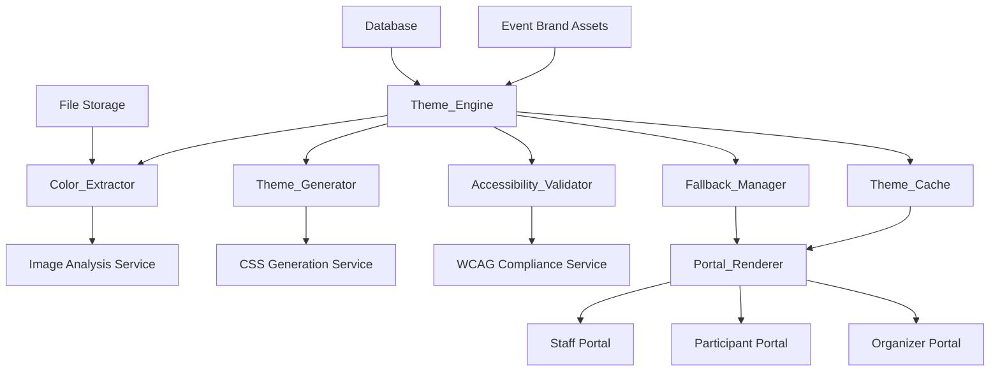
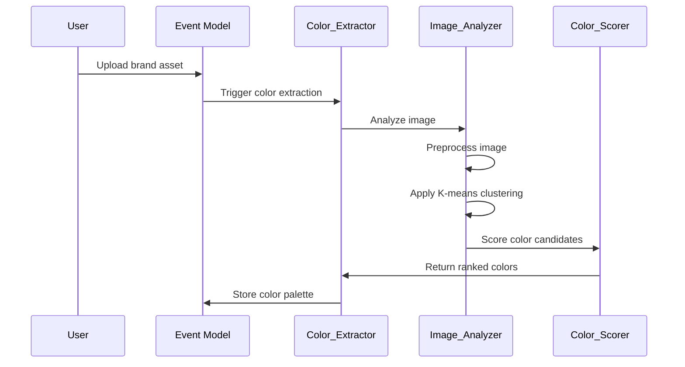
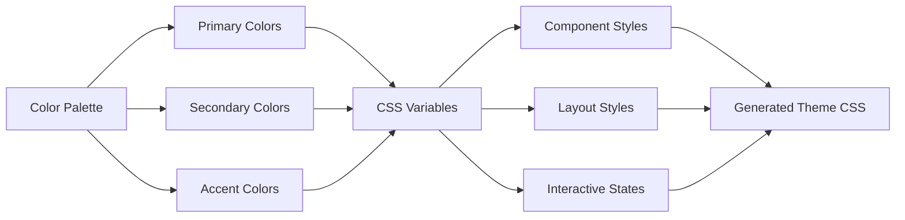
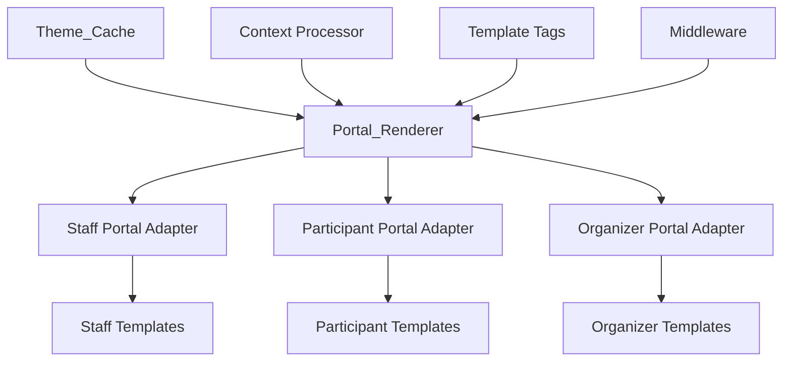
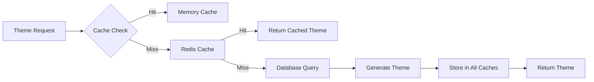
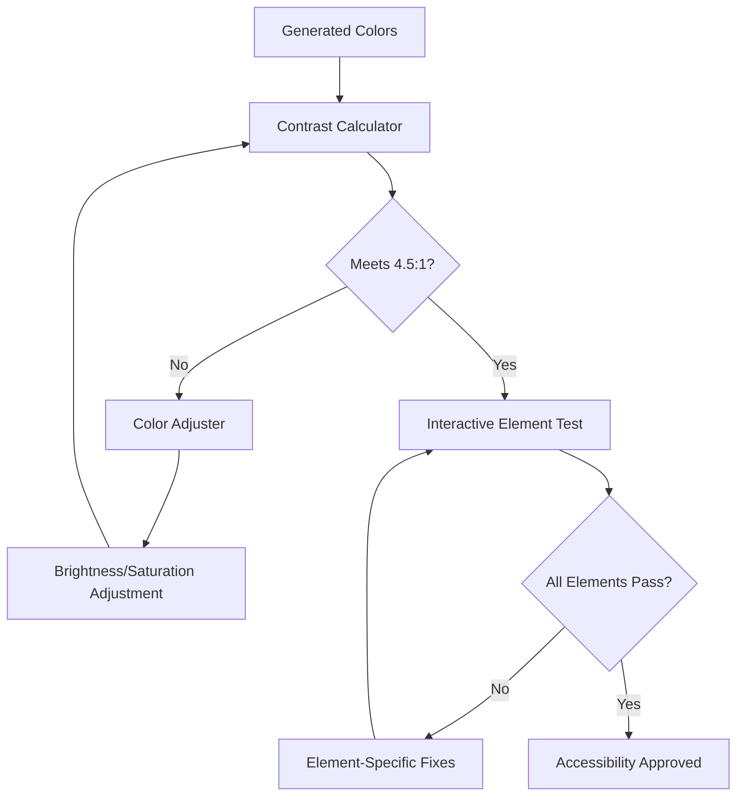
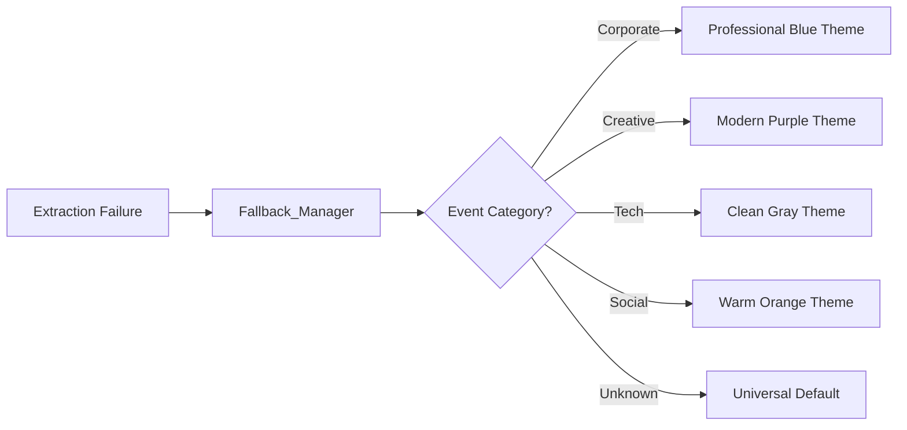

# Design Document: Dynamic Event Theming System

## Overview

The Dynamic Event Theming System is a comprehensive solution that automatically extracts colors from event brand assets (logos, banners) and generates accessible, responsive CSS themes applied consistently across all three portals: Staff, Participant, and Organizer. The system enhances the professional appearance of the platform by making each event feel like it has its own custom-built interface while maintaining accessibility standards and optimal performance.

### Key Design Principles

- **Automated Intelligence**: Minimal manual intervention required for theme generation
- **Accessibility First**: All generated themes meet WCAG 2.1 AA standards
- **Performance Optimized**: Efficient caching and async processing
- **Portal Consistency**: Unified theming across all three user interfaces
- **Graceful Degradation**: Robust fallback systems for edge cases
- **Responsive Design**: Themes adapt seamlessly across all device types

### System Goals

1. **Brand Consistency**: Ensure event branding is reflected uniformly across all portals
2. **User Experience**: Provide a premium, custom-built feel for each event
3. **Accessibility Compliance**: Maintain WCAG standards without compromising visual appeal
4. **Performance**: Deliver themes efficiently without impacting page load times
5. **Maintainability**: Create a system that's easy to extend and modify

## Architecture

### High-Level System Architecture

The Dynamic Event Theming System follows a modular, service-oriented architecture with clear separation of concerns:



### Core Components

#### 1. Theme_Engine (Central Orchestrator)
- **Purpose**: Coordinates the entire theming workflow
- **Responsibilities**: 
  - Manages theme generation lifecycle
  - Handles async processing queues
  - Coordinates between all subsystems
  - Manages theme versioning and updates

#### 2. Color_Extractor (Image Analysis)
- **Purpose**: Analyzes brand assets to extract color palettes
- **Technology**: Python with Pillow, scikit-learn for color clustering
- **Capabilities**:
  - Dominant color extraction using K-means clustering
  - Smart background detection and exclusion
  - Confidence scoring for extracted colors
  - Support for multiple image formats

#### 3. Theme_Generator (CSS Creation)
- **Purpose**: Converts color palettes into complete CSS themes
- **Technology**: Python with Jinja2 templating, CSS optimization
- **Features**:
  - Generates complementary color schemes
  - Creates hover states and interactive variations
  - Produces responsive CSS with media queries
  - Optimizes and minifies output

#### 4. Accessibility_Validator (WCAG Compliance)
- **Purpose**: Ensures all generated themes meet accessibility standards
- **Standards**: WCAG 2.1 AA compliance
- **Validation**:
  - Contrast ratio calculations (4.5:1 for normal text, 3:1 for large text)
  - Color blindness simulation testing
  - Interactive element accessibility verification

#### 5. Portal_Renderer (Theme Application)
- **Purpose**: Applies themes consistently across all portals
- **Integration**: Django template system with custom context processors
- **Features**:
  - Dynamic CSS injection
  - Portal-specific customizations
  - Real-time theme switching
  - Fallback handling

#### 6. Theme_Cache (Performance Optimization)
- **Purpose**: Stores and serves generated themes efficiently
- **Technology**: Redis for fast access, database for persistence
- **Strategy**:
  - Multi-level caching (memory, Redis, database)
  - Intelligent cache invalidation
  - Compressed theme storage

#### 7. Fallback_Manager (Error Handling)
- **Purpose**: Provides professional defaults when extraction fails
- **Features**:
  - Industry-specific default themes
  - Manual override capabilities
  - Error logging and notification
  - Graceful degradation strategies
## Components and Interfaces

### Color Extraction Pipeline

#### Image Processing Workflow



#### Color_Extractor Interface

```python
class ColorExtractor:
    def extract_colors(self, image_path: str, num_colors: int = 5) -> ColorPalette:
        """Extract dominant colors from brand asset"""
        
    def analyze_image_properties(self, image_path: str) -> ImageProperties:
        """Analyze image characteristics for better extraction"""
        
    def calculate_confidence_scores(self, colors: List[Color]) -> List[float]:
        """Score extracted colors based on suitability for theming"""
```

#### Image Analysis Service

**Technology Stack:**
- **PIL/Pillow**: Image processing and manipulation
- **scikit-learn**: K-means clustering for color extraction
- **colorthief**: Alternative color extraction library
- **numpy**: Numerical operations on image data

**Processing Steps:**
1. **Image Preprocessing**:
   - Resize to optimal dimensions (max 800px)
   - Convert to RGB color space
   - Remove transparent pixels
   - Apply noise reduction filters

2. **Color Clustering**:
   - K-means clustering with k=8-12 clusters
   - Exclude near-white/near-black colors
   - Weight colors by pixel frequency
   - Calculate color harmony scores

3. **Color Selection**:
   - Rank colors by visual prominence
   - Ensure sufficient color diversity
   - Generate confidence scores (0-1 scale)
   - Select top 3-5 colors for theming

### Theme Generation Process

#### CSS Theme Architecture



#### Theme_Generator Interface

```python
class ThemeGenerator:
    def generate_theme(self, palette: ColorPalette, event: Event) -> Theme:
        """Generate complete CSS theme from color palette"""
        
    def create_color_variations(self, base_color: Color) -> ColorVariations:
        """Generate hover, active, and disabled states"""
        
    def generate_complementary_colors(self, palette: ColorPalette) -> ColorPalette:
        """Create additional colors for complete theme"""
        
    def optimize_css(self, css_content: str) -> str:
        """Minify and optimize generated CSS"""
```

#### CSS Generation Strategy

**CSS Custom Properties Structure:**
```css
:root {
  /* Primary Brand Colors */
  --theme-primary: #extracted-color-1;
  --theme-primary-light: #lightened-variant;
  --theme-primary-dark: #darkened-variant;
  
  /* Secondary Colors */
  --theme-secondary: #extracted-color-2;
  --theme-accent: #extracted-color-3;
  
  /* Neutral Colors */
  --theme-neutral-50: #generated-light;
  --theme-neutral-900: #generated-dark;
  
  /* Interactive States */
  --theme-hover: #calculated-hover;
  --theme-active: #calculated-active;
  --theme-focus: #calculated-focus;
}
```

**Component Mapping:**
- **Navigation**: Primary color backgrounds, contrasting text
- **Buttons**: Primary/secondary color schemes with hover states
- **Cards**: Subtle accent borders and backgrounds
- **Forms**: Focus states using theme colors
- **Headers**: Gradient backgrounds using primary colors
### Multi-Portal Integration

#### Portal_Renderer Architecture



#### Portal-Specific Adaptations

**Staff Portal Integration:**
- **Current Architecture**: Bootstrap-based with custom CSS variables
- **Integration Point**: Inject theme CSS variables into existing `:root` declarations
- **Customizations**: 
  - Maintain professional appearance with subtle branding
  - Preserve accessibility for scanning operations
  - Keep functional elements clearly distinguishable

**Participant Portal Integration:**
- **Current Architecture**: Responsive design with mobile-first approach
- **Integration Point**: Dynamic CSS injection via template context
- **Customizations**:
  - Prominent brand colors for engagement
  - Responsive theme adjustments for mobile devices
  - Enhanced visual hierarchy with brand colors

**Organizer Portal Integration:**
- **Current Architecture**: Tailwind CSS with custom components
- **Integration Point**: CSS custom properties override Tailwind defaults
- **Customizations**:
  - Professional dashboard appearance
  - Brand-consistent navigation and cards
  - Maintain complex UI component functionality

#### Theme Application Interface

```python
class PortalRenderer:
    def apply_theme(self, portal_type: str, theme: Theme, context: dict) -> dict:
        """Apply theme to specific portal context"""
        
    def generate_portal_css(self, theme: Theme, portal_type: str) -> str:
        """Generate portal-specific CSS overrides"""
        
    def validate_portal_compatibility(self, theme: Theme, portal_type: str) -> bool:
        """Ensure theme works with portal's UI components"""
```

### Performance Optimization

#### Caching Strategy



#### Multi-Level Caching Implementation

**Level 1: Memory Cache (Application Level)**
- **Technology**: Python dictionary with LRU eviction
- **Scope**: Most recently used themes per process
- **TTL**: 1 hour
- **Size Limit**: 100 themes per process

**Level 2: Redis Cache (Distributed)**
- **Technology**: Redis with compression
- **Scope**: All generated themes across instances
- **TTL**: 24 hours
- **Compression**: gzip for CSS content

**Level 3: Database Cache (Persistent)**
- **Technology**: PostgreSQL with JSON fields
- **Scope**: Long-term theme storage
- **TTL**: 30 days for inactive themes
- **Indexing**: Event ID, theme hash, creation date

#### Async Processing Architecture

```python
# Celery task for theme generation
@celery.app.task
def generate_theme_async(event_id: int, image_path: str):
    """Asynchronously generate theme for event"""
    
# WebSocket notification for completion
def notify_theme_ready(event_id: int, theme_id: str):
    """Notify organizer when theme is ready"""
```

**Processing Queue:**
- **Technology**: Celery with Redis broker
- **Priority Levels**: High (manual requests), Normal (auto-generation)
- **Retry Logic**: 3 attempts with exponential backoff
- **Monitoring**: Task status tracking and error reporting
### Accessibility Implementation

#### WCAG Compliance Validation



#### Accessibility_Validator Interface

```python
class AccessibilityValidator:
    def validate_contrast_ratios(self, theme: Theme) -> ValidationResult:
        """Check all color combinations meet WCAG standards"""
        
    def adjust_colors_for_compliance(self, theme: Theme) -> Theme:
        """Automatically adjust colors to meet accessibility requirements"""
        
    def test_color_blindness_compatibility(self, theme: Theme) -> ColorBlindnessResult:
        """Simulate different types of color blindness"""
        
    def validate_interactive_elements(self, theme: Theme) -> InteractiveValidationResult:
        """Ensure buttons, links, and forms remain accessible"""
```

#### Color Adjustment Algorithms

**Contrast Enhancement:**
1. **Luminance Calculation**: Use WCAG formula for relative luminance
2. **Iterative Adjustment**: Gradually adjust brightness/saturation
3. **Harmony Preservation**: Maintain color relationships while adjusting
4. **Minimum Change**: Make smallest adjustments necessary for compliance

**Color Blindness Considerations:**
- **Protanopia/Deuteranopia**: Ensure red/green distinction
- **Tritanopia**: Maintain blue/yellow contrast
- **Pattern/Texture**: Add non-color visual cues where needed

### Fallback Systems

#### Default Theme Management



#### Fallback_Manager Interface

```python
class FallbackManager:
    def get_default_theme(self, event_category: str) -> Theme:
        """Return appropriate default theme for event type"""
        
    def handle_extraction_failure(self, event: Event, error: Exception) -> Theme:
        """Gracefully handle color extraction failures"""
        
    def enable_manual_override(self, event: Event, colors: List[Color]) -> Theme:
        """Allow organizers to manually specify colors"""
        
    def log_fallback_usage(self, event: Event, reason: str) -> None:
        """Track fallback usage for system improvement"""
```

#### Error Handling Strategy

**Graceful Degradation Levels:**
1. **Primary**: Use extracted colors with full theme generation
2. **Secondary**: Use partial extraction with enhanced defaults
3. **Tertiary**: Use category-based default themes
4. **Final**: Use universal safe theme with notification

**Error Recovery:**
- **Automatic Retry**: Retry extraction with different parameters
- **Alternative Methods**: Try different color extraction algorithms
- **User Notification**: Inform organizers of extraction issues
- **Manual Intervention**: Provide tools for manual color selection
## Data Models

### Database Schema

#### Core Theme Models

```python
class EventTheme(models.Model):
    """Main theme model for events"""
    event = models.OneToOneField(Event, on_delete=models.CASCADE, related_name='theme')
    
    # Color Palette
    primary_color = models.CharField(max_length=7)  # Hex color
    secondary_color = models.CharField(max_length=7)
    accent_color = models.CharField(max_length=7)
    neutral_light = models.CharField(max_length=7)
    neutral_dark = models.CharField(max_length=7)
    
    # Generated CSS
    css_content = models.TextField()
    css_hash = models.CharField(max_length=64, unique=True)  # For caching
    
    # Metadata
    extraction_confidence = models.FloatField(default=0.0)  # 0-1 scale
    is_fallback = models.BooleanField(default=False)
    generation_method = models.CharField(max_length=50)  # 'auto', 'manual', 'fallback'
    
    # Accessibility
    wcag_compliant = models.BooleanField(default=True)
    contrast_adjustments_made = models.BooleanField(default=False)
    
    # Performance
    cache_key = models.CharField(max_length=100, unique=True)
    last_accessed = models.DateTimeField(auto_now=True)
    access_count = models.IntegerField(default=0)
    
    # Timestamps
    created_at = models.DateTimeField(auto_now_add=True)
    updated_at = models.DateTimeField(auto_now=True)
    
    class Meta:
        indexes = [
            models.Index(fields=['css_hash']),
            models.Index(fields=['cache_key']),
            models.Index(fields=['last_accessed']),
        ]

class ColorPalette(models.Model):
    """Extracted color palette from brand assets"""
    theme = models.OneToOneField(EventTheme, on_delete=models.CASCADE, related_name='palette')
    
    # Extracted Colors (JSON field for flexibility)
    extracted_colors = models.JSONField(default=list)  # [{"color": "#hex", "confidence": 0.9, "frequency": 0.3}]
    
    # Source Information
    source_image = models.CharField(max_length=255)  # Path to source image
    extraction_algorithm = models.CharField(max_length=50, default='kmeans')
    extraction_parameters = models.JSONField(default=dict)
    
    # Quality Metrics
    color_diversity_score = models.FloatField(default=0.0)
    overall_confidence = models.FloatField(default=0.0)
    
    created_at = models.DateTimeField(auto_now_add=True)

class ThemeVariation(models.Model):
    """Different variations of a theme (light/dark, different intensities)"""
    base_theme = models.ForeignKey(EventTheme, on_delete=models.CASCADE, related_name='variations')
    
    variation_type = models.CharField(max_length=50)  # 'light', 'dark', 'high_contrast'
    css_content = models.TextField()
    css_hash = models.CharField(max_length=64)
    
    is_active = models.BooleanField(default=True)
    created_at = models.DateTimeField(auto_now_add=True)

class ThemeCache(models.Model):
    """Cache table for theme performance optimization"""
    cache_key = models.CharField(max_length=100, unique=True, primary_key=True)
    theme = models.ForeignKey(EventTheme, on_delete=models.CASCADE, related_name='cache_entries')
    
    # Cached Content
    css_content = models.TextField()
    portal_type = models.CharField(max_length=20)  # 'staff', 'participant', 'organizer'
    
    # Cache Metadata
    created_at = models.DateTimeField(auto_now_add=True)
    last_accessed = models.DateTimeField(auto_now=True)
    access_count = models.IntegerField(default=0)
    expires_at = models.DateTimeField()
    
    class Meta:
        indexes = [
            models.Index(fields=['expires_at']),
            models.Index(fields=['last_accessed']),
        ]

class ThemeGenerationLog(models.Model):
    """Audit log for theme generation activities"""
    event = models.ForeignKey(Event, on_delete=models.CASCADE, related_name='theme_logs')
    
    # Operation Details
    operation_type = models.CharField(max_length=50)  # 'generation', 'fallback', 'manual_override'
    status = models.CharField(max_length=20)  # 'success', 'failure', 'partial'
    
    # Processing Information
    processing_time_ms = models.IntegerField(null=True)
    error_message = models.TextField(blank=True)
    extraction_confidence = models.FloatField(null=True)
    
    # Source Information
    source_image_path = models.CharField(max_length=255, blank=True)
    user = models.ForeignKey(User, on_delete=models.SET_NULL, null=True, blank=True)
    
    created_at = models.DateTimeField(auto_now_add=True)
    
    class Meta:
        indexes = [
            models.Index(fields=['created_at']),
            models.Index(fields=['status']),
        ]
```

#### Extended Event Model

```python
# Extension to existing Event model
class Event(models.Model):
    # ... existing fields ...
    
    # Enhanced branding fields
    brand_assets = models.JSONField(default=list)  # Multiple brand images
    theme_preferences = models.JSONField(default=dict)  # User preferences
    auto_theming_enabled = models.BooleanField(default=True)
    
    # Theme status
    theme_generation_status = models.CharField(
        max_length=20,
        choices=[
            ('pending', 'Pending'),
            ('processing', 'Processing'),
            ('completed', 'Completed'),
            ('failed', 'Failed'),
        ],
        default='pending'
    )
    theme_last_updated = models.DateTimeField(null=True, blank=True)
```
## API Design

### RESTful API Endpoints

#### Theme Management API

```python
# Theme CRUD Operations
GET    /api/v1/events/{event_id}/theme/           # Get current theme
POST   /api/v1/events/{event_id}/theme/           # Generate new theme
PUT    /api/v1/events/{event_id}/theme/           # Update theme
DELETE /api/v1/events/{event_id}/theme/           # Reset to default

# Color Extraction
POST   /api/v1/events/{event_id}/extract-colors/  # Extract colors from uploaded image
GET    /api/v1/events/{event_id}/color-palette/   # Get extracted color palette

# Theme Variations
GET    /api/v1/events/{event_id}/theme/variations/ # Get all theme variations
POST   /api/v1/events/{event_id}/theme/variations/ # Create theme variation

# Theme Preview
GET    /api/v1/events/{event_id}/theme/preview/{portal_type}/ # Preview theme for portal

# Cache Management
DELETE /api/v1/events/{event_id}/theme/cache/     # Clear theme cache
GET    /api/v1/themes/cache/stats/                # Cache performance stats
```

#### API Response Schemas

```python
# Theme Response Schema
{
    "id": "uuid",
    "event_id": "integer",
    "primary_color": "#hex",
    "secondary_color": "#hex",
    "accent_color": "#hex",
    "neutral_light": "#hex",
    "neutral_dark": "#hex",
    "css_content": "string",
    "extraction_confidence": "float",
    "is_fallback": "boolean",
    "wcag_compliant": "boolean",
    "generation_method": "string",
    "created_at": "datetime",
    "updated_at": "datetime"
}

# Color Extraction Response
{
    "extracted_colors": [
        {
            "color": "#hex",
            "confidence": "float",
            "frequency": "float",
            "name": "string"
        }
    ],
    "overall_confidence": "float",
    "processing_time_ms": "integer",
    "source_image": "string"
}

# Theme Preview Response
{
    "portal_type": "string",
    "css_content": "string",
    "preview_url": "string",
    "compatibility_score": "float"
}
```

#### WebSocket Events

```python
# Real-time theme generation updates
{
    "event": "theme_generation_started",
    "data": {
        "event_id": "integer",
        "estimated_completion": "datetime"
    }
}

{
    "event": "theme_generation_completed",
    "data": {
        "event_id": "integer",
        "theme_id": "uuid",
        "success": "boolean",
        "preview_url": "string"
    }
}

{
    "event": "theme_generation_failed",
    "data": {
        "event_id": "integer",
        "error_message": "string",
        "fallback_applied": "boolean"
    }
}
```

### Internal Service APIs

#### Color Extraction Service

```python
class ColorExtractionService:
    def extract_colors_from_image(
        self, 
        image_path: str, 
        num_colors: int = 5,
        algorithm: str = 'kmeans'
    ) -> ColorExtractionResult:
        """Extract dominant colors from image"""
        
    def analyze_image_properties(self, image_path: str) -> ImageAnalysis:
        """Analyze image characteristics"""
        
    def calculate_color_harmony(self, colors: List[Color]) -> float:
        """Calculate how well colors work together"""
```

#### Theme Generation Service

```python
class ThemeGenerationService:
    def generate_complete_theme(
        self, 
        color_palette: ColorPalette, 
        event: Event
    ) -> GeneratedTheme:
        """Generate complete CSS theme from color palette"""
        
    def create_portal_specific_css(
        self, 
        base_theme: Theme, 
        portal_type: str
    ) -> str:
        """Generate portal-specific CSS overrides"""
        
    def optimize_theme_performance(self, theme: Theme) -> OptimizedTheme:
        """Optimize theme for performance"""
```

#### Accessibility Validation Service

```python
class AccessibilityService:
    def validate_wcag_compliance(self, theme: Theme) -> AccessibilityReport:
        """Comprehensive WCAG compliance check"""
        
    def auto_fix_accessibility_issues(self, theme: Theme) -> Theme:
        """Automatically fix common accessibility issues"""
        
    def generate_accessibility_report(self, theme: Theme) -> AccessibilityReport:
        """Generate detailed accessibility report"""
```
## Security Considerations

### Image Processing Security

#### Safe Image Handling

```python
class SecureImageProcessor:
    ALLOWED_FORMATS = ['PNG', 'JPEG', 'JPG', 'WebP']
    MAX_FILE_SIZE = 10 * 1024 * 1024  # 10MB
    MAX_DIMENSIONS = (4000, 4000)  # 4K max
    
    def validate_image_safety(self, image_path: str) -> ValidationResult:
        """Comprehensive image security validation"""
        
    def sanitize_image(self, image_path: str) -> str:
        """Remove metadata and potential threats"""
        
    def scan_for_malicious_content(self, image_path: str) -> SecurityScanResult:
        """Scan for embedded malicious content"""
```

#### Security Measures

**File Upload Security:**
- **Format Validation**: Strict whitelist of allowed image formats
- **Size Limits**: Maximum file size and dimension restrictions
- **Content Scanning**: Scan for embedded scripts or malicious content
- **Metadata Stripping**: Remove EXIF and other metadata
- **Sandboxed Processing**: Process images in isolated environment

**Path Traversal Prevention:**
- **Filename Sanitization**: Remove dangerous characters from filenames
- **Secure Storage**: Store uploads in designated, restricted directories
- **Access Controls**: Limit file system access permissions
- **UUID Naming**: Use UUIDs for stored file names

### Theme Validation Security

#### CSS Injection Prevention

```python
class ThemeSecurityValidator:
    DANGEROUS_CSS_PATTERNS = [
        r'javascript:',
        r'expression\(',
        r'@import',
        r'url\([^)]*\.js',
        r'<script',
        r'</script>',
    ]
    
    def validate_css_safety(self, css_content: str) -> SecurityValidationResult:
        """Validate CSS content for security threats"""
        
    def sanitize_css_content(self, css_content: str) -> str:
        """Remove potentially dangerous CSS constructs"""
```

**CSS Security Measures:**
- **Pattern Matching**: Scan for dangerous CSS patterns
- **Whitelist Validation**: Only allow safe CSS properties and values
- **Content Sanitization**: Remove or escape dangerous content
- **CSP Headers**: Implement Content Security Policy headers

### Access Control

#### Permission-Based Theme Management

```python
class ThemePermissionManager:
    def can_modify_theme(self, user: User, event: Event) -> bool:
        """Check if user can modify event theme"""
        
    def can_view_theme_analytics(self, user: User, event: Event) -> bool:
        """Check if user can view theme performance data"""
        
    def can_override_auto_theming(self, user: User, event: Event) -> bool:
        """Check if user can disable auto-theming"""
```

**Access Control Rules:**
- **Event Ownership**: Only event organizers can modify themes
- **Team Permissions**: Team members with design permissions can edit themes
- **Admin Override**: Platform administrators can modify any theme
- **Read-Only Access**: Participants and staff can only view applied themes

### Data Privacy

#### Personal Information Protection

**Image Privacy:**
- **Automatic Cleanup**: Remove uploaded images after processing
- **No Personal Data**: Ensure brand assets don't contain personal information
- **Audit Logging**: Log all theme-related activities for security auditing
- **Data Retention**: Implement data retention policies for theme data

**Analytics Privacy:**
- **Anonymized Metrics**: Collect only necessary performance metrics
- **No User Tracking**: Don't track individual user theme preferences
- **Aggregated Data**: Only store aggregated usage statistics
## Correctness Properties

*A property is a characteristic or behavior that should hold true across all valid executions of a system-essentially, a formal statement about what the system should do. Properties serve as the bridge between human-readable specifications and machine-verifiable correctness guarantees.*

After analyzing the acceptance criteria, I've identified several areas where properties can be consolidated to eliminate redundancy while maintaining comprehensive coverage. For example, multiple criteria about contrast ratios can be combined into a single comprehensive accessibility property, and various UI consistency requirements can be unified into portal consistency properties.

### Property 1: Color Extraction Completeness

*For any* uploaded brand asset in a supported format, the Color_Extractor should extract at least 3 dominant colors with confidence scores, properly categorized as primary, secondary, and accent colors.

**Validates: Requirements 1.1, 1.2, 9.6**

### Property 2: Image Format Support and Error Handling

*For any* image file, the Color_Extractor should either successfully process supported formats (PNG, JPG, JPEG, SVG, WebP) or return appropriate error messages for unsupported formats specifying the supported formats.

**Validates: Requirements 1.4, 1.5**

### Property 3: Multi-Asset Prioritization

*For any* event with multiple brand assets, the Color_Extractor should prioritize the primary logo for color extraction while maintaining the ability to process all uploaded assets.

**Validates: Requirements 1.3**

### Property 4: Comprehensive Accessibility Compliance

*For any* generated theme, all color combinations should meet WCAG 2.1 AA contrast requirements (4.5:1 for normal text, 3:1 for large text) across all interactive elements including buttons, links, and form controls.

**Validates: Requirements 2.1, 2.3, 2.5**

### Property 5: Automatic Accessibility Correction

*For any* extracted color palette that fails contrast requirements, the Theme_Generator should automatically adjust brightness and saturation to achieve compliance while generating complementary neutral colors when palettes lack sufficient variety.

**Validates: Requirements 2.2, 2.4**

### Property 6: Cross-Portal Theme Consistency

*For any* generated event theme, the Portal_Renderer should apply identical color schemes and branding elements consistently across Staff, Participant, and Organizer portals while maintaining portal-specific functionality and UI component behavior.

**Validates: Requirements 3.1, 3.2, 3.3, 3.4, 3.6**

### Property 7: Comprehensive Theme Application

*For any* generated theme, the Portal_Renderer should apply theme colors to all specified UI elements (navigation menus, headers, buttons, cards, form elements) while maintaining readability and functionality.

**Validates: Requirements 3.5, 8.1**

### Property 8: Responsive Design Consistency

*For any* generated theme, the Responsive_Theme should maintain color contrast, readability, and visual consistency across all screen sizes from 320px to 4K resolution, including orientation changes and mobile touch target optimization.

**Validates: Requirements 4.1, 4.2, 4.3, 4.4**

### Property 9: Theme Variation Support

*For any* base theme, the system should generate both light and dark mode variations that maintain accessibility compliance and visual harmony.

**Validates: Requirements 4.6, 7.3**

### Property 10: Caching and Performance Consistency

*For any* event theme, the Theme_Cache should store generated themes and serve identical theme instances to all users accessing the same event, with automatic cleanup of unused themes after 30 days.

**Validates: Requirements 5.1, 5.5, 5.6**

### Property 11: CSS Optimization and Validation

*For any* generated theme, the Theme_Generator should produce compressed, valid, error-free CSS that maintains cross-browser compatibility across Chrome, Firefox, Safari, and Edge.

**Validates: Requirements 5.3, 10.3, 10.4**

### Property 12: Asynchronous Processing Integrity

*For any* theme generation request, the Theme_Engine should process color extraction asynchronously without blocking UI operations while maintaining data integrity and user experience.

**Validates: Requirements 5.4**
### Property 13: Fallback System Reliability

*For any* color extraction failure or corrupted brand asset, the Fallback_Manager should apply appropriate industry-specific default themes, log errors, notify organizers, and maintain a library of at least 10 professional default themes.

**Validates: Requirements 6.1, 6.2, 6.3, 6.5, 6.6**

### Property 14: Manual Override Functionality

*For any* event theme, organizers should be able to manually select colors, make adjustments, preview themes, and reset to automatic extraction, with all manual changes triggering accessibility re-validation.

**Validates: Requirements 6.4, 7.1, 7.2, 7.4, 7.6**

### Property 15: Preference Persistence

*For any* organizer making theme preferences or adjustments, the system should save these preferences and apply them to future events by the same organization.

**Validates: Requirements 7.5**

### Property 16: Advanced Color Processing

*For any* brand asset, the Color_Extractor should handle transparent backgrounds, prioritize non-text elements over text overlays, ignore white/near-white backgrounds, detect and exclude watermarks, and generate complementary colors for monochromatic images.

**Validates: Requirements 9.1, 9.2, 9.3, 9.4, 9.5**

### Property 17: Visual Harmony and Branding

*For any* generated theme, the Theme_Engine should create harmonious color hierarchies, generate complementary gradients and hover effects, maintain brand color prominence while ensuring functional element discoverability, and preserve brand visual identity.

**Validates: Requirements 8.2, 8.3, 8.4, 8.6**

### Property 18: UI Compatibility and Validation

*For any* applied theme, the Theme_Generator should validate that all existing UI components remain functional and interactive elements continue to work correctly without breaking existing functionality.

**Validates: Requirements 10.1, 10.2**

### Property 19: Automatic Error Recovery

*For any* theme application that causes UI issues, the Fallback_Manager should automatically detect problems and revert to a safe default theme to maintain system stability.

**Validates: Requirements 10.5**

### Property 20: Comprehensive Logging and Metrics

*For any* theme generation operation, the system should log detailed metrics including processing time, confidence scores, error messages, and quality indicators for monitoring and improvement purposes.

**Validates: Requirements 10.6**

## Error Handling

### Error Classification and Response Strategy

#### Critical Errors (System-Breaking)
- **Image Processing Failures**: Corrupted files, unsupported formats, malicious content
- **CSS Generation Errors**: Invalid color values, template rendering failures
- **Database Errors**: Theme storage failures, cache corruption
- **Response**: Immediate fallback to safe default theme, error logging, admin notification

#### Warning Errors (Degraded Experience)
- **Low Confidence Extraction**: Poor quality images, insufficient color variety
- **Accessibility Adjustments**: Colors requiring significant modification for compliance
- **Performance Issues**: Slow processing, cache misses
- **Response**: Apply best-effort solution, notify organizer, log for improvement

#### Information Events (Normal Operation)
- **Successful Generation**: Theme created and cached successfully
- **Cache Hits**: Theme served from cache
- **Manual Overrides**: Organizer customizations applied
- **Response**: Standard logging, analytics collection

### Error Recovery Mechanisms

#### Graceful Degradation Levels
1. **Full Functionality**: Extracted colors with complete theme generation
2. **Partial Functionality**: Some colors extracted with enhanced defaults
3. **Fallback Mode**: Category-based default themes
4. **Safe Mode**: Universal accessible theme

#### Retry Strategies
- **Automatic Retry**: Up to 3 attempts with different extraction parameters
- **Alternative Algorithms**: Try different color extraction methods
- **Reduced Quality**: Lower resolution processing for large images
- **Manual Intervention**: Provide tools for organizer override

## Testing Strategy

### Dual Testing Approach

The Dynamic Event Theming System requires both unit testing and property-based testing to ensure comprehensive coverage and reliability.

**Unit Testing Focus:**
- Specific color extraction scenarios with known inputs and expected outputs
- Edge cases like transparent images, monochromatic logos, and corrupted files
- Integration points between Theme_Engine components
- Portal-specific CSS generation and application
- Error handling and fallback mechanisms
- Security validation for image processing and CSS generation

**Property-Based Testing Focus:**
- Universal properties that hold across all valid inputs and configurations
- Color extraction consistency across different image types and sizes
- Accessibility compliance verification for all generated themes
- Cross-portal consistency validation
- Performance characteristics under various load conditions
- Cache behavior and data integrity across concurrent operations

### Property-Based Testing Configuration

**Testing Framework**: Hypothesis (Python) for property-based testing
**Test Iterations**: Minimum 100 iterations per property test to ensure statistical confidence
**Test Data Generation**: 
- Random image generation with controlled color distributions
- Synthetic brand assets with various characteristics
- Edge case generation for boundary testing

**Property Test Tagging Format:**
Each property-based test must include a comment referencing the design document property:
```python
# Feature: dynamic-event-theming, Property 1: Color Extraction Completeness
def test_color_extraction_completeness(image_data):
    # Test implementation
```

### Integration Testing Strategy

**Cross-Portal Testing**: Verify themes work consistently across all three portals
**Browser Compatibility**: Automated testing across Chrome, Firefox, Safari, and Edge
**Responsive Testing**: Verify themes across different screen sizes and orientations
**Performance Testing**: Load testing for theme generation and caching systems
**Security Testing**: Validate image processing security and CSS injection prevention

### Accessibility Testing

**Automated WCAG Testing**: Integrate accessibility testing tools into CI/CD pipeline
**Color Contrast Validation**: Automated contrast ratio checking for all generated themes
**Screen Reader Testing**: Verify themes work correctly with assistive technologies
**Color Blindness Simulation**: Test themes with different types of color blindness

The combination of unit tests for specific scenarios and property-based tests for universal behaviors ensures the Dynamic Event Theming System maintains high quality, accessibility, and reliability across all use cases and edge conditions.